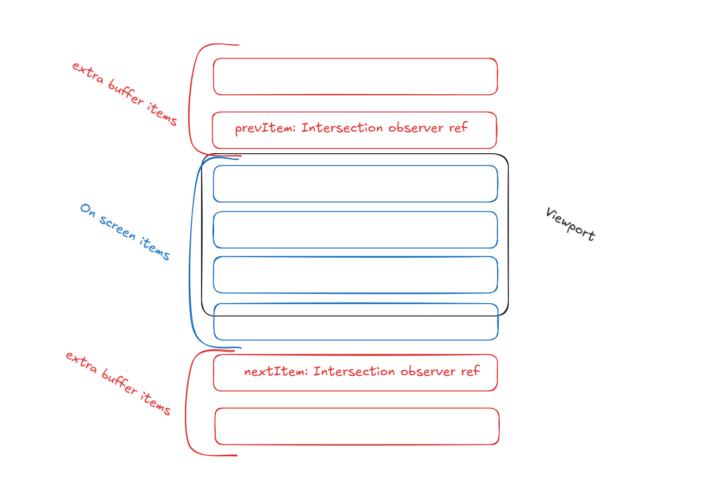

# harmony-mock-interview-virtual-scroll

## The task

> https://doc.clickup.com/3853550/d/h/3nk7e-55535/675f71c67f4f21e
>
> ### Instructions
> You are tasked with implementing a VirtualScroll React component to efficiently render a large list of items while displaying only those currently visible in the viewport. This component will ensure smooth scrolling and minimal rendering of off-screen items.

## Initial Thoughts

> - Render only the items currently visible in the viewport based on the scroll position.

I thought of rendering an extra quarter of a full page scroll of items so it would seem like an infinite list. From the requirements of the exercise we don't have to worry about pre-fetching / pre-buffering a stream request because we have the entire data array in memory.

I immediately search for scroll position on Google because I remember using that in the past to force scroll the user to a component alongside the intersection observer api.

Set the root component's div to the given viewport height:
```html
<div style={{ height: viewportHeight }}>
```

I would never do it that way personally. I would do it in a responsive way but I guess that the responsivness could be calculated at the parent component where this one is implemented in.

Now I would want to attach the viewport observer on the last and first items of my list. I guess that my extra number of items that needs to be rendered off screen can be generally 20% of the current number of items in view per scroll direction:
> If my itemHeight is 30 in a viewport of 300 I have 10 items seen but I would want to render extra 4 ((10 * 0.2) * 2 == 14 items in total) items where 2 extra items (offset - 2) are off screen on the "previous" scroll, and 2 more items (offset + 2) are rendered off screen on the "next" scroll per scroll direction.

> If my itemHeight is 100 in a viewport of 300 I have 3 items seen but I would want to render extra 2 (ceiling(3 * 0.2) * 2) items where 1 extra item (offset - 1) is off screen on the "previous" scroll, and 1 more item (offset + 1) is rendered off screen on the "next" scroll per scroll direction.

I would put the scroll view intersect observers on the immediate first and last offscreen items like so:


### Obvious Disclaimer

If the task was given at my actual job I would just search for an already made library that implements this way more efficiently then I could under 1 hour.